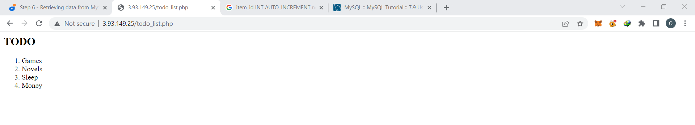

# Lemp stack Implementation

## Step 1

`sudo apt update`

`sudo apt install nginx`

`sudo systemctl status nginx`

`curl http://localhost:80`

`curl -s http://169.254.169.254/latest/meta-data/public-ipv4`

`http://<Public-IP-Address>:80`

## Step 2

`sudo apt install mysql-server`

`sudo mysql`

`sudo mysql_secure_installation`

`sudo mysql -p`

`mysql> exit`

## Step 3

`sudo apt install php-fpm php-mysql`

## Step 4

`sudo mkdir /var/www/projectLEMP`

`sudo chown -R $USER:$USER /var/www/projectLEMP`

`sudo nano /etc/nginx/sites-available/projectLEMP`

Paste  
> #/etc/nginx/sites-available/projectLEMP
\
>server {
    
    listen 80;

    server_name projectLEMP www.projectLEMP; 

    root /var/www/projectLEMP

    index index.html index.htm index.php;

    location / {
        try_files $uri $uri/ =404;
    }

    location ~ \.php$ {
        include snippets/fastcgi-php.conf;
        fastcgi_pass unix:/var/run/php/php8.1-fpm.sock;
     }

    location ~ /\.ht {
        deny all;
    }

>}

`sudo ln -s /etc/nginx/sites-available/projectLEMP /etc/nginx/sites-enabled/`

`sudo nginx -t`

`sudo systemctl reload nginx`

`sudo echo 'Hello LEMP from hostname' $(curl -s http://169.254.169.254/latest/meta-data/public-hostname) 'with public IP' $(curl -s http://169.254.169.254/latest/meta-data/public-ipv4) > /var/www/projectLEMP/index.html`

`http://<Public-IP-Address>:80`

`http://<Public-DNS-Name>:80`

## Step 5

`sudo nano /var/www/projectLEMP/info.php`

> Type: <?php
\
phpinfo();

`http://server_domain_or_IP/info.php`

`sudo rm /var/www/your_domain/info.php`

## Step 6

`sudo mysql`

`mysql> CREATE DATABASE `example_database`;`

`mysql>  CREATE USER 'example_user'@'%' IDENTIFIED WITH mysql_native_password BY 'password';`

`mysql> GRANT ALL ON example_database.* TO 'example_user'@'%';`

`mysql> exit`

`mysql -u example_user -p`

`mysql> SHOW DATABASES;`

`CREATE TABLE example_database.todo_list (`

`mysql>     item_id INT AUTO_INCREMENT,`

`mysql>     content VARCHAR(255),`

`mysql>     PRIMARY KEY(item_id)`

`mysql> );`

`mysql> INSERT INTO example_database.todo_list (content) VALUES ("My first important item");`

`mysql>  SELECT * FROM example_database.todo_list;`

`mysql> exit`

`nano /var/www/projectLEMP/todo_list.php`

`http://<Public_domain_or_IP>/todo_list.php`

